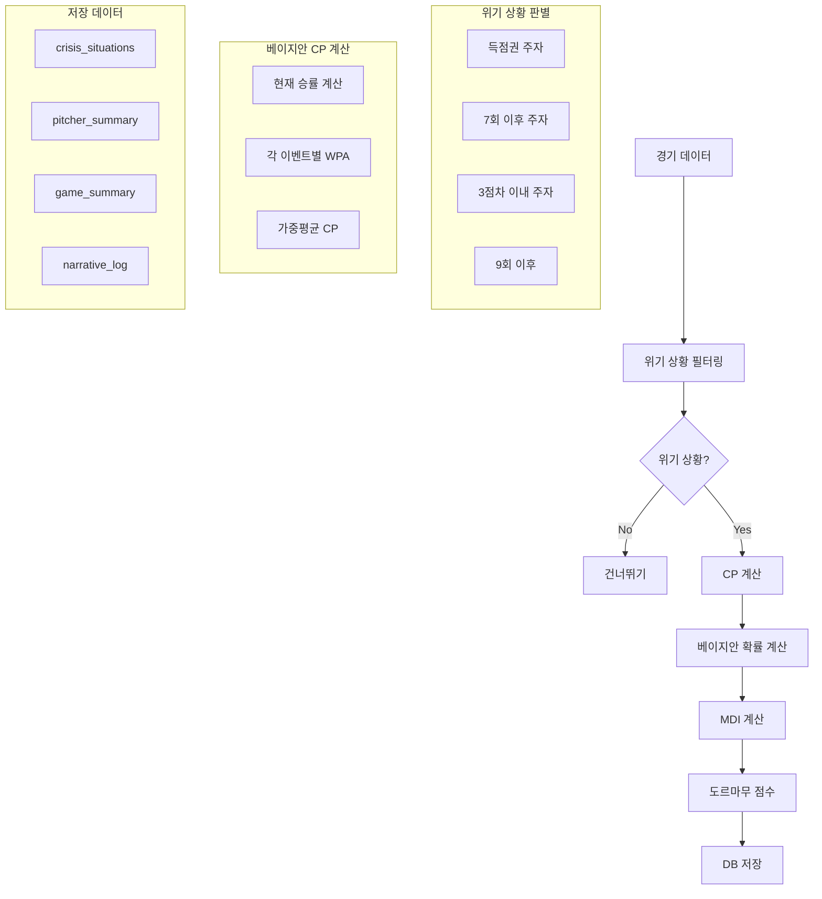

# 🔮 도르마무(DORMAMMU) 지수 - 개념과 계산 플로우

## 📌 도르마무란?

**DORMAMMU (Dynamic Outcome Risk Management And Momentum Understanding)**

야구에서 **투수의 위기 관리 능력**을 수치화한 독창적인 지표입니다.
단순한 방어율(ERA)이나 WHIP을 넘어, **실제 위기 상황에서 얼마나 실점을 막았는가**를 측정합니다.

### 핵심 개념
- **CP (Crisis Probability)**: 위기 확률 - 현재 상황에서 실점할 확률
- **MDI (Momentum Disruption Index)**: 모멘텀 파괴 지수 - 경기 흐름 변화 정도
- **WPA (Win Probability Added)**: 승률 기여도 - 플레이로 인한 승률 변화

## 🔄 계산 플로우



## 🧮 상세 계산 과정

### 1. 위기 상황 필터링
```python
def is_crisis_situation(pa):
    """위기 상황 판별"""
    # 득점권 (2루 또는 3루에 주자)
    if pa.base2 or pa.base3:
        return True
    
    # 7회 이후 주자 있음
    if pa.inning >= 7 and (pa.base1 or pa.base2 or pa.base3):
        return True
    
    # 접전(3점차 이내) 상황에서 주자
    if abs(pa.score_diff) <= 3 and any_runners:
        return True
    
    # 9회 이후 모든 상황
    if pa.inning >= 9:
        return True
    
    return False
```

### 2. CP (Crisis Probability) 계산

#### 2.1 현재 승률 계산
```python
def get_win_probability(inning, score_diff, outs, base_state):
    """현재 상황의 승률"""
    # Pythagorean expectation 변형
    if score_diff == 0:
        base_wp = 0.5
    else:
        runs_ratio = (4.5 + score_diff) / (4.5 - score_diff)
        base_wp = runs_ratio² / (runs_ratio² + 1)
    
    # 이닝 조정
    innings_left = 9 - inning + (1 - outs/3)
    adjustment = min(1.0, innings_left / 9)
    
    # 주자 보너스
    if base3: bonus += 0.03
    if base2: bonus += 0.02
    if base1: bonus += 0.01
    
    return adjusted_wp
```

#### 2.2 베이지안 가중평균
```python
def calculate_cp(situation):
    """베이지안 CP 계산"""
    current_wp = get_win_probability(situation)
    
    # 각 이벤트별 확률과 WPA
    events = [
        ('K',   0.17, strikeout_wpa),
        ('OUT', 0.50, out_wpa),
        ('BB',  0.09, walk_wpa),
        ('1B',  0.165, single_wpa),
        ('2B',  0.04, double_wpa),
        ('3B',  0.003, triple_wpa),
        ('HR',  0.02, homerun_wpa)
    ]
    
    # 가중평균 CP
    cp = Σ(probability × wpa) / Σ(probability)
    
    return cp
```

### 3. MDI (Momentum Disruption Index) 계산
```python
def calculate_mdi(wpa, leverage_index, situation_weight):
    """모멘텀 파괴 지수"""
    mdi = abs(wpa) × leverage_index × situation_weight
    
    # Garbage time 조정
    if abs(score_diff) >= 7:
        mdi = min(mdi, 0.05)
    
    return mdi
```

### 4. 도르마무 점수 산출
```python
def calculate_dormammu_score(pitcher_stats):
    """최종 도르마무 점수"""
    # CP 극복률
    overcome_rate = crises_overcome / total_crises
    
    # 평균 CP 대비 실점률
    performance_ratio = actual_runs / expected_runs
    
    # 가중 점수
    dormammu_score = (
        overcome_rate * 0.4 +           # 극복률 40%
        (1 - performance_ratio) * 0.3 + # 기대 대비 성과 30%
        avg_mdi * 0.3                   # 모멘텀 영향 30%
    ) * 100
    
    return dormammu_score
```

## 📊 데이터 구조

### 위기 상황 테이블 (dormammu_crisis_situations)
```sql
CREATE TABLE dormammu_crisis_situations (
    id SERIAL PRIMARY KEY,
    game_id VARCHAR(20),
    pa_id INTEGER,
    pitcher_pcode VARCHAR(10),
    batter_pcode VARCHAR(10),
    inning INTEGER,
    outs INTEGER,
    runners VARCHAR(3),  -- '123' 형태
    score_diff INTEGER,
    cp FLOAT,           -- 위기 확률
    mdi FLOAT,          -- 모멘텀 지수
    outcome VARCHAR(10), -- 결과 (K, BB, 1B, etc)
    runs_allowed INTEGER,
    overcome BOOLEAN    -- 극복 여부
);
```

### 투수 요약 테이블 (dormammu_pitcher_summary)
```sql
CREATE TABLE dormammu_pitcher_summary (
    pitcher_pcode VARCHAR(10),
    season INTEGER,
    total_crises INTEGER,        -- 총 위기 상황
    crises_overcome INTEGER,     -- 극복한 위기
    total_cp FLOAT,             -- 누적 CP
    avg_cp FLOAT,               -- 평균 CP
    expected_runs FLOAT,        -- 예상 실점
    actual_runs INTEGER,        -- 실제 실점
    dormammu_score FLOAT,       -- 최종 점수
    grade VARCHAR(2)            -- S, A, B, C, D
);
```

## 🎯 활용 사례

### 1. 투수 평가
```python
# 도르마무 점수별 등급
def get_pitcher_grade(dormammu_score):
    if score >= 90: return 'S'  # Elite 위기관리
    if score >= 80: return 'A'  # Excellent
    if score >= 70: return 'B'  # Good
    if score >= 60: return 'C'  # Average
    return 'D'                  # Below Average
```

### 2. 매치업 분석
```python
def analyze_matchup(pitcher, batter):
    """투수-타자 매치업 도르마무 분석"""
    historical_cp = get_historical_cp(pitcher, batter)
    overcome_rate = get_overcome_rate(pitcher, batter)
    
    if historical_cp > 0.4 and overcome_rate < 0.5:
        return "위험한 매치업"
    elif overcome_rate > 0.8:
        return "유리한 매치업"
    else:
        return "평균적 매치업"
```

### 3. 게임 서사 생성
```python
def generate_narrative(crisis_situation):
    """위기 상황 서사 생성"""
    if crisis_situation.cp > 0.5:
        if crisis_situation.overcome:
            return f"🔥 {crisis_situation.cp*100:.0f}% 절체절명 위기 극복!"
        else:
            return f"😱 {crisis_situation.cp*100:.0f}% 위기가 현실로..."
```

## 🔬 특별한 점

### 1. 한국 야구 최적화
- KBO 실제 데이터 기반 확률
- 9회 말 끝내기 상황 특별 처리
- 한국 야구 특유의 스몰볼 반영

### 2. 베이지안 접근
- 단순 평균이 아닌 확률적 가중평균
- 각 이벤트의 실제 발생 확률 반영
- 상황별 세밀한 조정

### 3. 실시간 계산 가능
- 캐싱으로 빠른 계산
- 배치 처리로 대량 데이터 처리
- API로 실시간 조회

## 📈 발전 방향

1. **머신러닝 통합**: 투수별 개인화된 CP 모델
2. **심리적 요소**: 관중, 날씨, 연속 경기 영향
3. **예측 모델**: 다음 타석 CP 예측
4. **팀 도르마무**: 팀 전체의 위기 관리 능력

---

**도르마무는 단순한 숫자가 아닌, 야구의 드라마를 담은 지표입니다.**