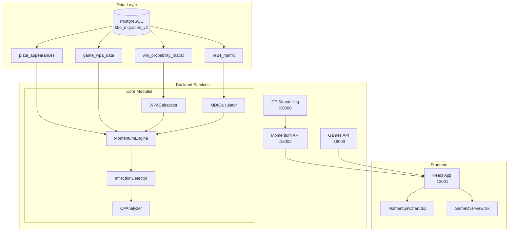
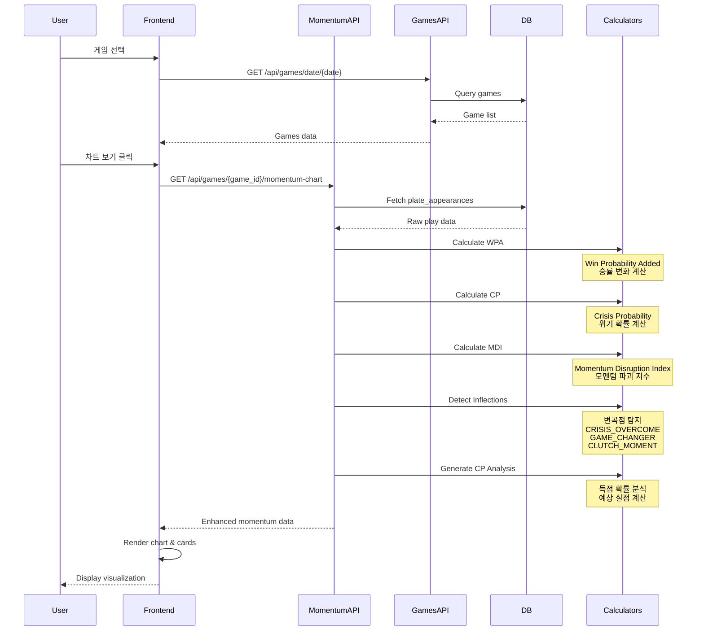

# KBO 모멘텀 차트 시스템 - 기술 문서

## 시스템 아키텍처



## 데이터 플로우



## 핵심 지표 계산

### 1. WPA (Win Probability Added)
```python
WPA = P(win|after) - P(win|before)

# 승률 매트릭스 기반 계산
def calculate_wpa(before_state, after_state):
    win_prob_before = get_win_probability(
        inning, outs, base_state, score_diff
    )
    win_prob_after = get_win_probability(
        inning+1, new_outs, new_base_state, new_score_diff
    )
    return win_prob_after - win_prob_before
```

### 2. CP (Crisis Probability)
```python
CP = base_scoring_probability × momentum_multiplier

# 베이스 상태별 득점 확률 (실제 데이터)
base_scoring_matrix = {
    ('111', 2): 0.260,  # 만루 2사
    ('110', 1): 0.134,  # 1,2루 1사
    # ...
}

# 모멘텀 배수 (1.0 ~ 2.5)
momentum_multiplier = f(leverage_index, inning, score_diff)
```

### 3. MDI (Momentum Disruption Index)
```python
MDI = |WPA| × leverage_index × situation_weight

# Garbage time 조정
if abs(score_diff) >= 7:
    MDI = min(MDI, 0.05)
```

### 4. 변곡점 탐지 알고리즘
```python
class InflectionDetector:
    thresholds = {
        'CRISIS_OVERCOME': {'cp_min': 0.3, 'runs_allowed': 0},
        'GAME_CHANGER': {'wpa_min': 0.15, 'mdi_min': 0.3},
        'CLUTCH_MOMENT': {'li_min': 2.0, 'wpa_min': 0.05},
        'MOMENTUM_SHIFT': {'mdi_min': 0.2},
        'DORMAMMU_PEAK': {'cp_min': 0.4, 'mdi_min': 0.4}
    }
    
    def detect_inflection(play, context, prev_play):
        # 우선순위에 따라 체크
        if check_crisis_overcome(play):
            return generate_cp_analysis(play)
        # ...
```

## 데이터 구조

### Inflection Point with CP Analysis
```typescript
interface InflectionPoint {
  play_id: number;
  type: 'CRISIS_OVERCOME' | 'GAME_CHANGER' | 'CLUTCH_MOMENT' | ...;
  confidence: number;
  metrics: {
    wpa: number;
    cp: number;
    mdi: number;
    li: number;
  };
  context: {
    cp_analysis?: {
      base_scoring_prob: number;    // 기본 득점 확률
      expected_runs: number;         // 예상 실점
      actual_runs: number;          // 실제 실점
      leverage_context: string;     // 중요도 설명
    };
  };
}
```

## 성능 최적화

### 1. 데이터베이스 인덱싱
```sql
CREATE INDEX idx_pa_game_id ON plate_appearances(game_id);
CREATE INDEX idx_wpa_game_id ON game_wpa_data(game_id);
CREATE INDEX idx_wpm_composite ON win_probability_matrix(
    inning, is_home, score_diff, base_out_state
);
```

### 2. 캐싱 전략
- Redis 캐싱: 계산된 모멘텀 데이터 (TTL: 1시간)
- Frontend 메모이제이션: React.memo로 차트 컴포넌트 최적화
- API 응답 압축: gzip 압축 적용

### 3. 배치 처리
```python
# 병렬 처리로 성능 향상
from concurrent.futures import ThreadPoolExecutor

with ThreadPoolExecutor(max_workers=4) as executor:
    futures = [
        executor.submit(calculate_wpa, play),
        executor.submit(calculate_cp, play),
        executor.submit(calculate_mdi, play)
    ]
```

## 시각화 구현

### Chart.js 하이브리드 차트
```javascript
datasets: [
  {
    type: 'line',       // WPA 누적 승률
    label: '승률',
    yAxisID: 'y'
  },
  {
    type: 'bar',        // CP 위기 확률
    label: 'CP',
    yAxisID: 'y1'
  }
]

// Annotation 플러그인으로 변곡점 표시
annotations: {
  ...crisisOvercomePoints.map(point => ({
    type: 'label',
    content: '↓',
    color: 'black'
  }))
}
```

## API 엔드포인트

### 1. 게임 목록 조회
```
GET /api/games/date/{date}
Response: {
  games: [{
    game_id: string,
    home_team: string,
    away_team: string,
    ...
  }]
}
```

### 2. 모멘텀 차트 데이터
```
GET /api/games/{game_id}/momentum-chart
Response: {
  game_id: string,
  momentum_series: [{
    play_id: number,
    wpa: number,
    cp: number,
    mdi: number,
    ...
  }],
  inflection_points: [{
    type: string,
    confidence: number,
    context: {
      cp_analysis: {...}
    }
  }]
}
```

## 테스트 전략

### 1. 단위 테스트
- WPA 계산 정확도
- CP 매트릭스 검증
- 변곡점 탐지 임계값

### 2. 통합 테스트
- API 응답 시간 < 500ms
- 차트 렌더링 성능
- 메모리 누수 체크

### 3. 부하 테스트
- 동시 접속 100명 처리
- 시간당 10,000 API 요청 처리